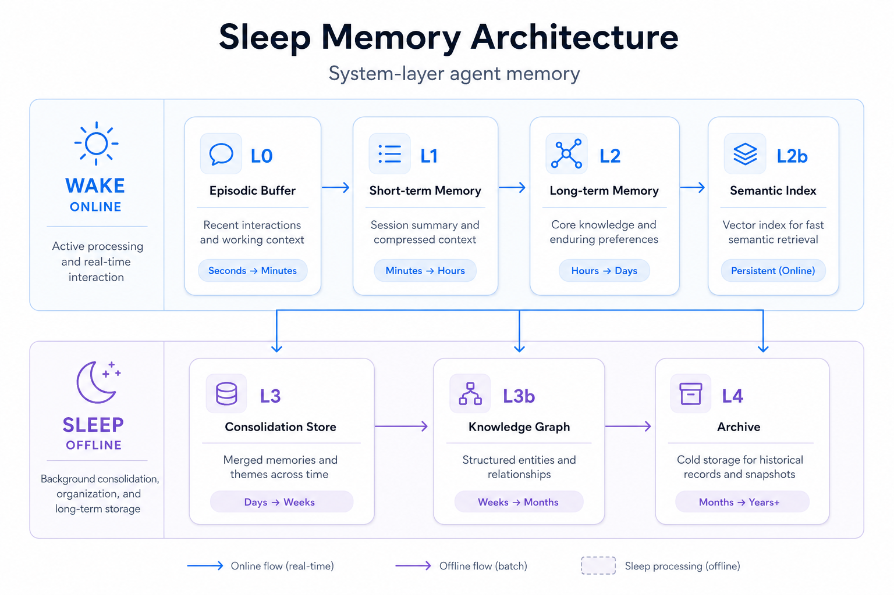
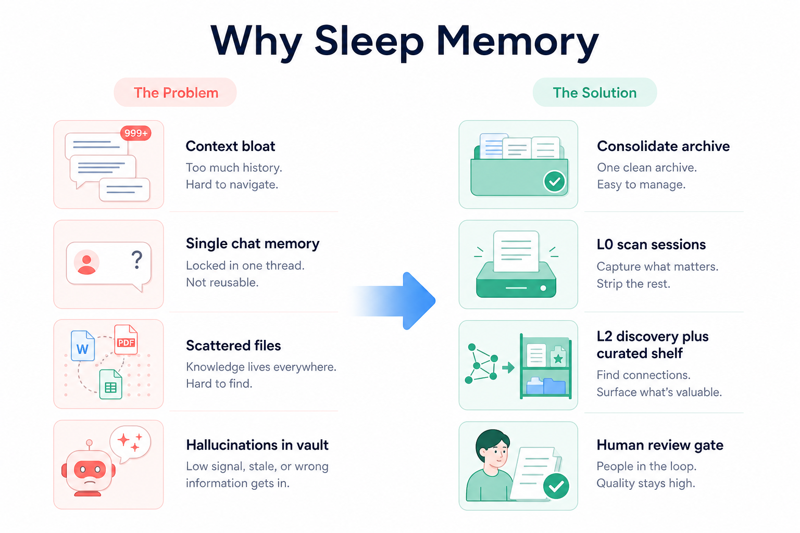
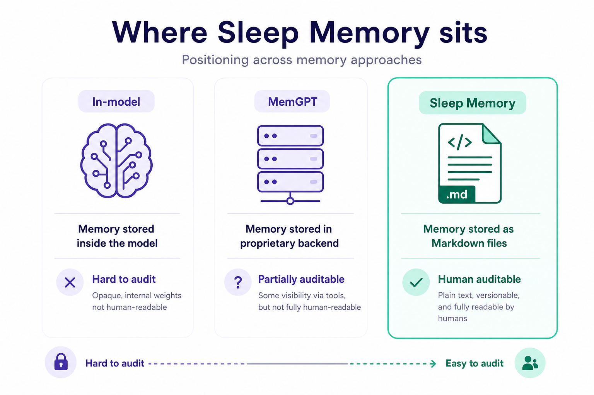
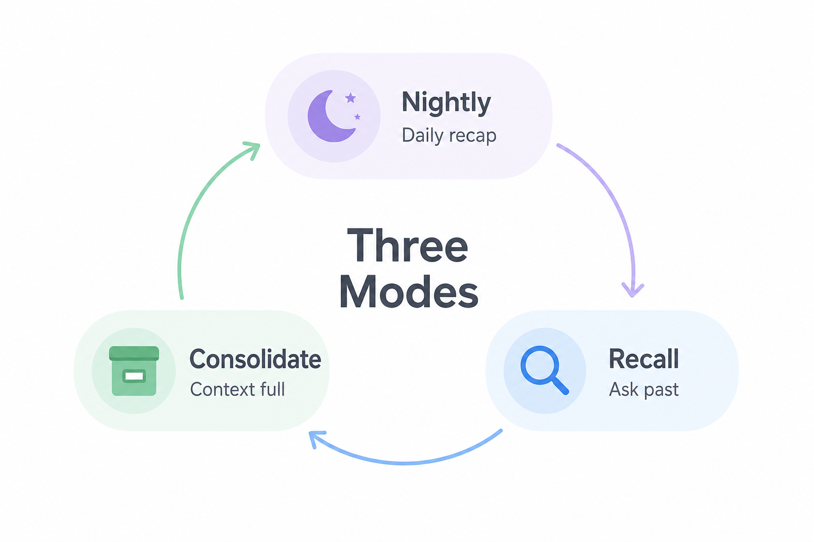
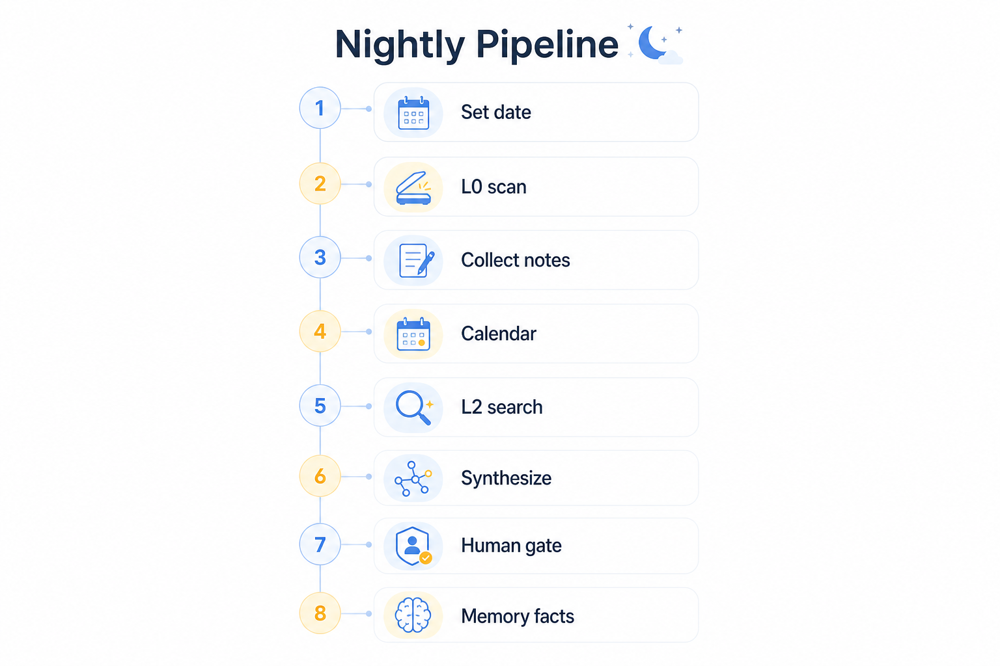
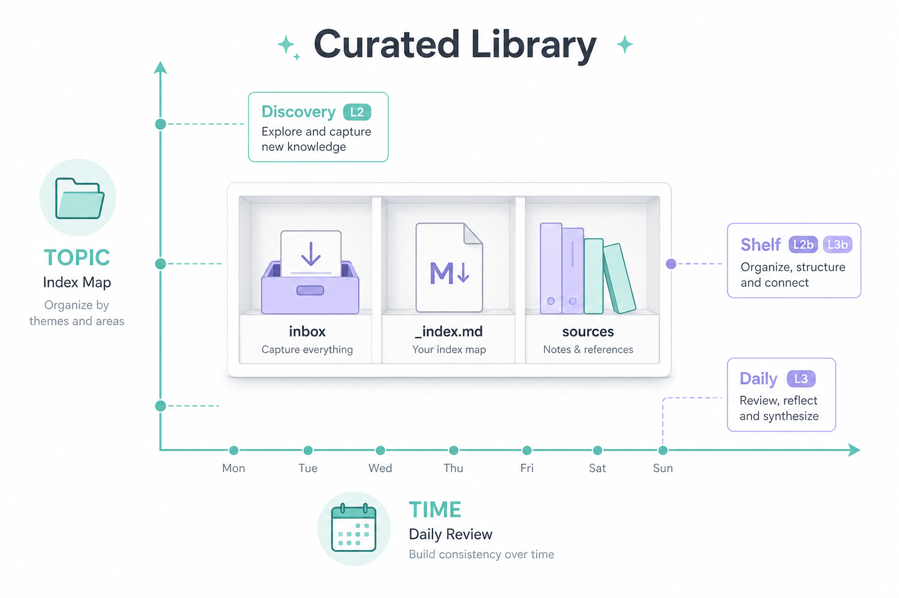
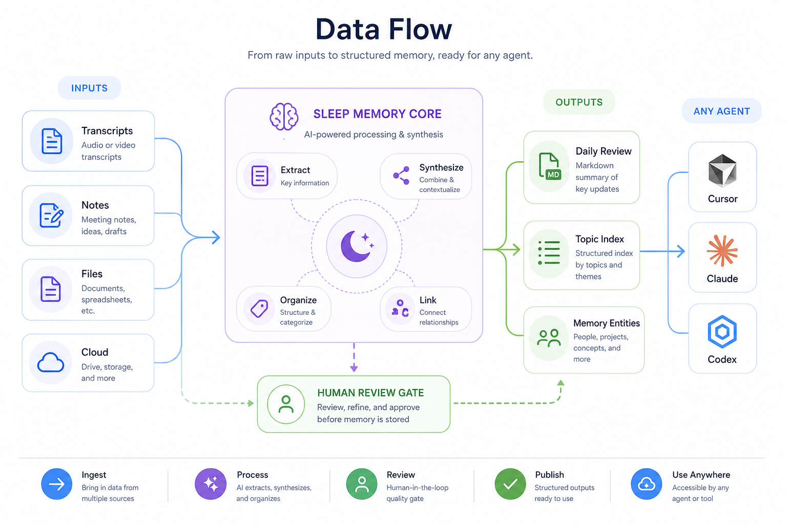

# Sleep Memory

<p align="center">
  English · <a href="README.md">简体中文</a>
</p>

<p align="center">
  
</p>

<p align="center">
  <strong>System-layer long-term memory for agents</strong> — no model training, no weight updates, usable today.<br>
  <em>Tool-agnostic · human-auditable · portable Markdown assets</em>
</p>

<p align="center">
  <a href="docs/architecture.md">Architecture</a> ·
  <a href="docs/curated-library-workflow.md">Curated library</a> ·
  <a href="docs/nightly-pipeline.md">Pipeline</a> ·
  <a href="docs/paper-mapping.md">Paper mapping</a> ·
  <a href="SKILL.md">Agent Skill</a>
</p>

---

## One-liner

> **Context is RAM, not disk.**  
> While your agent “sleeps” (offline), consolidate high-value information into **searchable, editable, portable** files and indexes. On wake-up (new session), carry only recap links and pull full text on demand.

Inspired by [Language Models Need Sleep](https://arxiv.org/abs/2605.26099) (2026): long-horizon reasoning needs **consolidation → fixed-capacity memory → clear short-term cache**.  
This project implements the same pattern at the **OS + notes + search + MCP** layer — **not tied** to Cursor, Gety, or Obsidian.

---

## Why you need this now

<p align="center">
  
</p>

> Illustrations: minimalist light-theme infographics (`docs/assets/en/`) · Structure refs in [docs/assets/mermaid/](docs/assets/mermaid/)

| Symptom | Root cause | This framework |
|---------|------------|----------------|
| Slower, costlier long chats | Using “disk” as RAM | L1 for now; L3/L4 consolidate offline |
| Amnesia across sessions | Memory locked in one thread | L0 cross-session scan + L3 daily review |
| “I wrote it” but can’t find it | No unified retrieval | L2 full-disk discovery + L2b topic index |
| Notes exist but agent hallucinates | No retrieval / no cites | `recall` mode: search first, then answer |
| ASR / agent guesses in vault | Machine inference without review | `## Pending your review` — not committed by default |

---

## Core architecture: L0–L4 + curated library

Not “yet another RAG” — **layered memory + dual-axis organization** (time × topic):

<p align="center">
  
</p>

| Layer | Name | Responsibility | Recommended (swappable) |
|-------|------|----------------|-------------------------|
| **L0** | Session scan | Aggregate **all agent chats today**, not just current window | Cursor `agent-transcripts` · Claude Code logs · custom JSONL |
| **L1** | Working memory | Only what this turn needs | Any agent context window |
| **L2** | Hot retrieval | **Discover** docs across disks | [Gety](https://gety.ai) · Recoll · Raycast · Listary + scripts |
| **L2b** | Topic retrieval | **Precise** search in high-value topic folders | Gety folder connector · Everything + fixed paths · ripgrep in vault |
| **L3** | Consolidation notes | **By date**: what you learned today | Obsidian · Logseq · Notion md export · local Yuque mirror |
| **L3b** | Topic map | **By topic**: where authoritative files live | `{CURATED_LIBRARY}/{topic}/_index.md` |
| **L4** | Entity facts | Short cross-session facts (paths, prefs, project names) | Memory MCP · mem0 · Zep · `facts.json` |

> **Sovereignty**: L3/L3b files are yours; L2 is an index accelerator you can replace anytime.

---

## Positioning vs. the paper and MemGPT

<p align="center">
  
</p>

| Dimension | Paper (in-model) | MemGPT / commercial memory | **Sleep Memory** |
|-----------|------------------|----------------------------|------------------|
| Memory carrier | Parameters / modules | In-service store | **Markdown + folders + MCP** |
| Editable | Hard | Partial API | **Edit in Obsidian** |
| Auditable | Black box | Vendor-dependent | **Git diff / human read** |
| Deployment | Change inference stack | SDK integration | **Skill + scripts** |
| Offline consolidation | Gradient “sleep” | Auto summary | **nightly + human gate** |

See [docs/paper-mapping.md](docs/paper-mapping.md).

---

## Tool ecosystem: pick one row per layer

**Any one row per layer is enough** — you don’t need the exact stack below.

### Agent runtime (who “thinks”)

| Tool | L0 source | L1 context | Integration |
|------|-----------|------------|-------------|
| **Cursor** | `~/.cursor/projects/*/agent-transcripts/` | Built-in | [SKILL.md](SKILL.md) |
| **Claude Code** | Session logs / CLI history | Built-in | MCP + adapted Skill |
| **Codex / Windsurf** | Exported project chats | Built-in | MCP → L2 |
| **ChatGPT / Claude Web** | Manual paste / browser export | Web | L3 notes + manual recap only |
| **OpenClaw / custom agent** | Custom JSONL | Any | HTTP MCP → L2 API |

### Retrieval (who “finds files”)

| Tool | Layer | Notes |
|------|-------|-------|
| **[Gety](https://gety.ai)** | L2 + L2b | Local-first semantic + OCR + MCP/CLI |
| **Recoll / DocFetcher** | L2 | Open-source full-text, no semantics |
| **Listary / Everything** | L2 assist | Fast filename lookup |
| **Raycast / Alfred** | L2 assist | Workflow triggers |
| **Obsidian search** | L3 only | Within vault |
| **Hard-coded `_index.md`** | L2b/L3b | Zero deps — agent reads map first |

### Consolidation (who “keeps notes”)

| Tool | Layer | Daily review path example |
|------|-------|----------------------------|
| **Obsidian** | L3 | `{vault}/日复盘/YYYY/YYYY-MM-DD.md` |
| **Logseq** | L3 | Journal + block refs |
| **Notion** | L3 | Export md or API sync |
| **Yuque / Lark Docs** | L3 source | Script pull → local md |
| **Curated library folder** | L3b | `{CURATED_LIBRARY}/{topic}/_index.md` |

### Facts (who “remembers snippets”)

| Tool | Layer |
|------|-------|
| **Memory MCP** | L4 (default in this repo) |
| **mem0 / Zep** | L4 service alternatives |
| **YAML frontmatter** | Minimal L4 |

---

## Three operating modes

<p align="center">
  
</p>

| Mode | Trigger | Output | Typical use |
|------|---------|--------|-------------|
| **nightly** | End-of-day recap | `日复盘/YYYY-MM-DD.md` | Cross-project daily summary |
| **consolidate** | Long chat, before clearing context | `会话巩固/{date}-{slug}.md` | Mid-task archive |
| **recall** | “What did we say?” / “Where is that file?” | Verbal answer + path cites | No file write required |

---

## Nightly pipeline

<p align="center">
  
</p>

```bash
# 1. Environment
export OBSIDIAN_VAULT="$HOME/Obsidian"
export CURATED_LIBRARY_ROOT="$HOME/curated-library"   # optional

# 2. L0 all-day sessions
python scripts/scan-day-transcripts.py --date 2026-06-16 --json

# 3. Today's deltas (Obsidian / Chrome / Yuque)
python scripts/collect-day-sources.py --date 2026-06-16 --json

# 4. Agent side: copy SKILL.md → ~/.cursor/skills/sleep-memory/
#    Say: "nightly recap" or /sleep-memory nightly
```

Step-by-step: [docs/nightly-pipeline.md](docs/nightly-pipeline.md) · Template: [references/nightly-template.md](references/nightly-template.md)

---

## Curated library: time × topic

Full-disk search solves **findable**; curated library solves **precise** — and **does not require Gety forever**.

<p align="center">
  
</p>

```
curated-library/                 # CURATED_LIBRARY_ROOT
├── _MOC.md                      # top navigation
├── inbox/                       # triage today
└── {topic}/
    ├── _index.md                # chapter → exam points → file paths (core)
    └── sources/                 # optional hard links to originals
```

- Workflow: [docs/curated-library-workflow.md](docs/curated-library-workflow.md)
- Index template: [references/curated-index-template.md](references/curated-index-template.md)
- Sample: [examples/curated-library-modian-sample.md](examples/curated-library-modian-sample.md)

**Gety users**: `gety connector add "$CURATED_LIBRARY_ROOT" --name "Folder: 精选库"`  
**Non-Gety users**: agent `Read {topic}/_index.md` at session start.

---

## Data flow overview

<p align="center">
  
</p>

---

## Quick start (minimal)

**15-minute version** — agent + Markdown folders only:

1. Create `~/Obsidian/日复盘/` and `~/curated-library/inbox/`
2. Copy [SKILL.md](SKILL.md) to your agent skill directory
3. Each evening: **“nightly recap”**
4. (Optional) Gety / Memory MCP / Yuque token

**Full version**: [docs/curated-library-workflow.md](docs/curated-library-workflow.md)

---

## Repository layout

```
sleep-memory/
├── README.md                         # 简体中文
├── README.en.md                      # English (this file)
├── SKILL.md                          # Agent entry (Cursor / MCP-capable IDEs)
├── docs/
│   ├── assets/
│   │   ├── architecture.png          # hero diagram (zh)
│   │   ├── architecture-en.png       # hero diagram (en)
│   │   ├── zh/ en/                   # minimalist light infographics
│   │   └── mermaid/                  # structural .mmd refs (optional)
│   ├── architecture.md
│   ├── curated-library-workflow.md
│   ├── nightly-pipeline.md
│   ├── paper-mapping.md
│   └── privacy.md
├── scripts/
│   ├── render-diagrams.ps1           # regenerate PNGs from .mmd
│   ├── scan-day-transcripts.py
│   └── collect-day-sources.py
├── references/
│   ├── layers.md
│   ├── nightly-template.md
│   └── curated-index-template.md
└── examples/
    ├── daily-review-sample.md
    └── curated-library-modian-sample.md
```

---

## Privacy and governance

- Daily reviews **must not** store raw secrets or full third-party private chats
- ASR / agent inference → default `## Pending your review`; **you approve** before L4
- Sensitive dirs can be **excluded from L2**; reference manually in L3 only
- See [docs/privacy.md](docs/privacy.md)

---

## Reference metrics (personal env, not a guarantee)

| Metric | Approx. |
|--------|---------|
| One nightly output | 300–800 readable words |
| Context after archiving rare skills | 78% → ~15% (one case) |
| Voice pipeline | transcribe → summary → `手机录音/YYYY-MM/` |

---

## Related projects

| Project | Relationship |
|---------|--------------|
| [Language Models Need Sleep](https://arxiv.org/abs/2605.26099) | Theory; this repo is system-layer implementation |
| [MemGPT / Letta](https://github.com/letta-ai/letta) | Paged memory; can coexist; we bias toward human-readable notes |
| [Khoj](https://github.com/khoj-ai/khoj) / AnythingLLM | RAG Q&A; we bias toward daily recap + topic maps |
| Gety / Recoll | L2 implementation choices, not hard deps |
| Cursor Rules / Skills | Static instructions; Sleep Memory adds **dynamic recap** |

---

## License & citation

MIT — [LICENSE](LICENSE)

```bibtex
@misc{sleep-memory2026,
  title  = {Sleep Memory: System-Layer Consolidation for Long-Horizon Agents},
  author = {Angela-letter},
  year   = {2026},
  url    = {https://github.com/Angela-letter/sleep-memory},
  note   = {Tool-agnostic sleep consolidation: L0--L4 + curated library}
}
```

---

<p align="center">
  <sub>The paper studies how models sleep · this repo studies how your agent workflow sleeps · memory lives in Markdown, not a black hole</sub>
</p>
