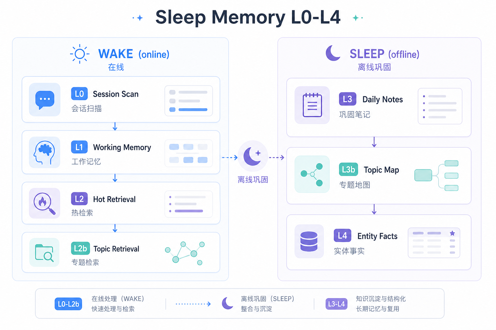
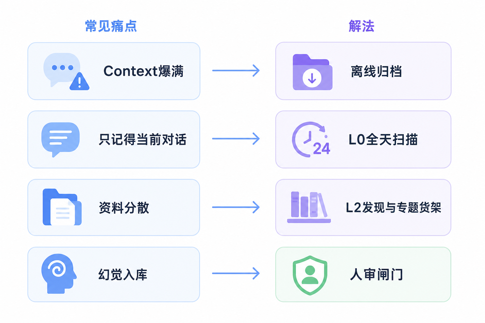
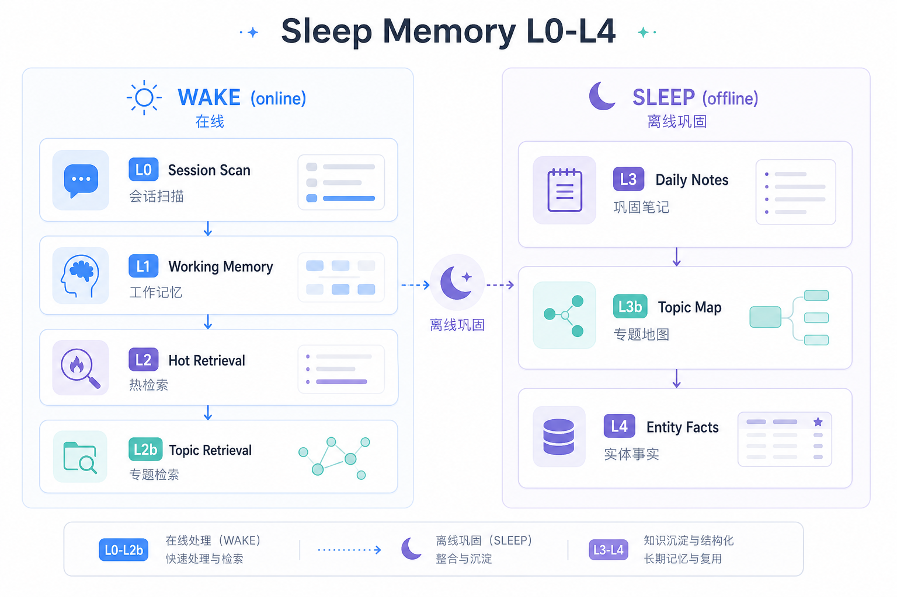
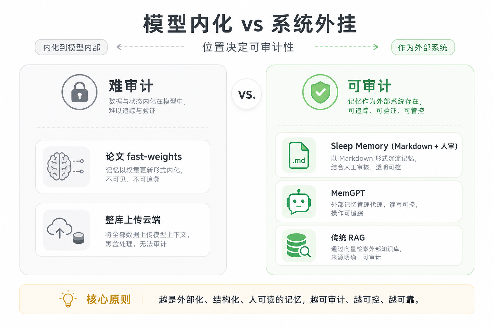
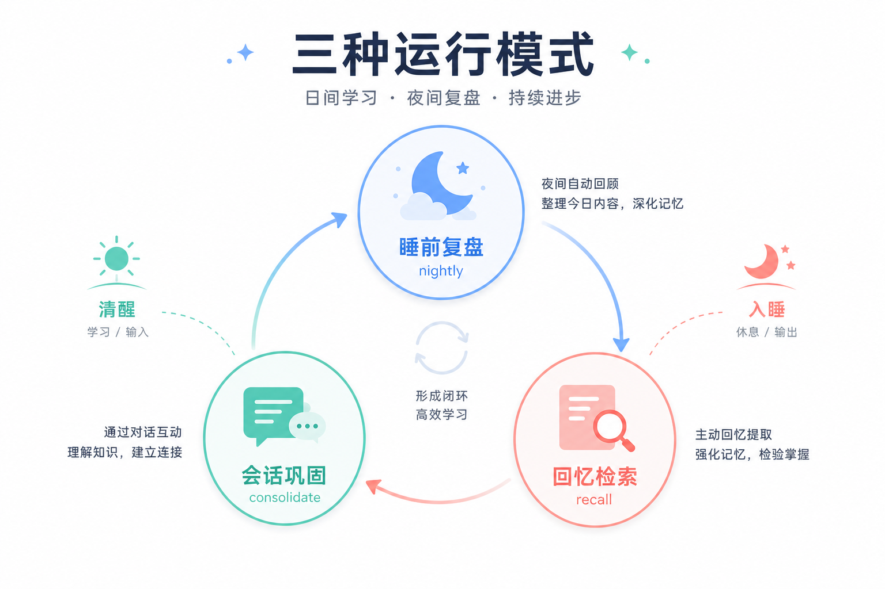
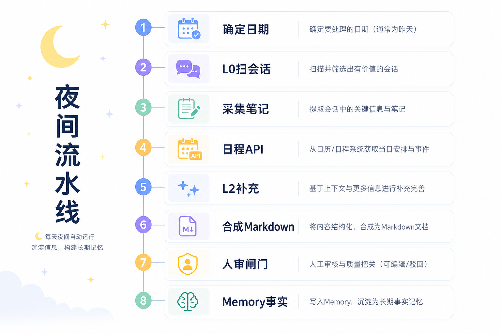
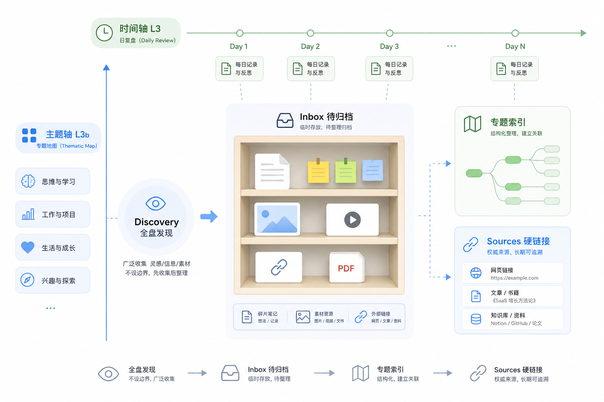
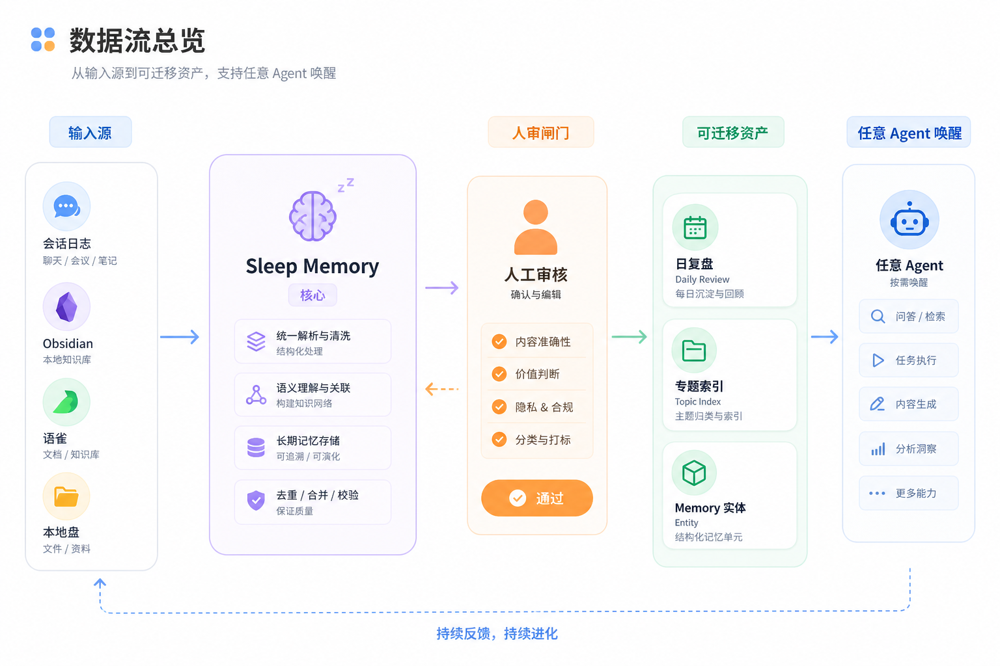

# Sleep Memory · 睡眠记忆

<p align="center">
  <a href="README.en.md">English</a> · 简体中文
</p>

<p align="center">
  
</p>

<p align="center">
  <strong>系统层 Agent 长期记忆框架</strong> — 不训练模型、不改权重、今天就能用。<br>
  <em>System-layer consolidation for long-horizon agents · tool-agnostic · human-auditable</em>
</p>

<p align="center">
  <a href="docs/architecture.md">架构</a> ·
  <a href="docs/curated-library-workflow.md">精选库</a> ·
  <a href="docs/nightly-pipeline.md">流水线</a> ·
  <a href="docs/paper-mapping.md">论文对照</a> ·
  <a href="SKILL.md">Agent Skill</a>
</p>

---

## 一句话

> **Context 是 RAM，不是硬盘。**  
> 在 Agent 睡觉（离线）时，把高价值信息巩固进**可检索、可编辑、可迁移**的文件与索引；醒来（新会话）只带 recap 链接，按需拉取全文。

灵感来自 [Language Models Need Sleep](https://arxiv.org/abs/2605.26099)（2026）：长程推理需要 **巩固 → 固定容量记忆 → 清空短期 cache**。  
本项目在 **操作系统 + 笔记 + 搜索 + MCP** 层实现同一范式，**不绑定** Cursor、Gety 或 Obsidian。

---

## 为什么现在需要这个

<p align="center">
  
</p>

> 配图：简约亮色信息图（`docs/assets/zh/`）· 结构参考见 [docs/assets/mermaid/](docs/assets/mermaid/)

| 现象 | 根因 | 本框架的解法 |
|------|------|--------------|
| 聊越久越慢、越贵 | 把「硬盘」当 RAM 用 | L1 只留当下；L3/L4 离线巩固 |
| 换会话就「失忆」 | 记忆锁在单个 thread | L0 跨会话扫描 + L3 日复盘 |
| 「我记得写过」但找不到 | 缺统一检索层 | L2 全盘发现 + L2b 专题索引 |
| 笔记有了 Agent 仍胡编 | 没接检索、没 cite | recall 模式：先搜再答 |
| 录音/ASR 误听入库 | 机器推断无审核 | `## 待你确认` 默认不入库 |

---

## 核心架构：L0–L4 + 精选库

不是「又一个 RAG」，而是 **分层记忆 + 双轴组织**（时间 × 主题）：

<p align="center">
  
</p>

| 层 | 名称 | 抽象职责 | 推荐实现（可替换） |
|----|------|----------|-------------------|
| **L0** | 会话扫描 | 汇总「今天所有 Agent 对话」，不只当前窗口 | Cursor `agent-transcripts` · Claude Code logs · 自定义 JSONL |
| **L1** | 工作记忆 | 仅放此刻推理需要的片段 | 任意 Agent 的 context window |
| **L2** | 热检索 | **发现**散落在各盘的文档 | [Gety](https://gety.ai) · Recoll · Raycast · Listary + 脚本 |
| **L2b** | 专题检索 | **精准**搜高价值专题目录 | Gety folder · Everything + 固定路径 · ripgrep in vault |
| **L3** | 巩固笔记 | **按日期**叙事：今天学了什么 | Obsidian · Logseq · Notion 导出 md · 语雀本地镜像 |
| **L3b** | 专题地图 | **按主题**索引：权威文件在哪 | `{CURATED_LIBRARY}/专题/_index.md` |
| **L4** | 实体事实 | 跨会话短事实（路径、偏好、项目名） | Memory MCP · mem0 · Zep · `facts.json` |

> **主权原则**：L3/L3b 的文件归你所有；L2 只是索引加速器，可随时替换。

---

## 与论文、与 MemGPT 的定位

<p align="center">
  
</p>

| 维度 | 论文（模型内化） | MemGPT / 商业 Memory | **Sleep Memory** |
|------|------------------|----------------------|------------------|
| 记忆载体 | 参数 / 专用模块 | 服务内存储 | **Markdown + 文件夹 + MCP** |
| 可编辑 | 难 | 部分 API | **Obsidian 直接改** |
| 可审计 | 黑箱 | 依赖厂商 | **Git diff / 人读** |
| 部署 | 改推理栈 | 接 SDK | **Skill + 脚本** |
| 离线巩固 | 梯度式睡眠 | 自动摘要 | **nightly + 人审闸门** |

详见 [docs/paper-mapping.md](docs/paper-mapping.md)。

---

## 工具生态：普适适配表

**任意一行凑齐即可运行**；不必与下表完全一致。

### Agent 运行时（谁在「思考」）

| 工具 | L0 会话来源 | L1 Context | 接入方式 |
|------|-------------|------------|----------|
| **Cursor** | `~/.cursor/projects/*/agent-transcripts/` | 内置 | [SKILL.md](SKILL.md) |
| **Claude Code** | 会话日志 / CLI 历史 | 内置 | MCP + Skill 改写 |
| **Codex / Windsurf** | 项目内 chat 导出 | 内置 | MCP 检索 L2 |
| **ChatGPT / Claude Web** | 手动粘贴 / 浏览器导出 | 网页 | 仅用 L3 笔记 + 人工 recap |
| **OpenClaw / 自建 Agent** | 自定义 JSONL | 任意 | HTTP MCP → L2 API |

### 检索层（谁在「找文件」）

| 工具 | 对应层 | 特点 |
|------|--------|------|
| **[Gety](https://gety.ai)** | L2 + L2b | 全盘语义 + OCR + MCP/CLI，本地优先 |
| **Recoll / DocFetcher** | L2 | 开源全文检索，无语义 |
| **Listary / Everything** | L2 辅助 | 文件名极速定位 |
| **Raycast / Alfred** | L2 辅助 | 工作流触发搜索 |
| **Obsidian 内置搜索** | L3 内 | 仅 vault 内 |
| **硬编码 `_index.md`** | L2b/L3b | 零依赖，Agent 先读地图 |

### 巩固层（谁在「记笔记」）

| 工具 | 对应层 | 日复盘路径示例 |
|------|--------|----------------|
| **Obsidian** | L3 | `{vault}/日复盘/YYYY/YYYY-MM-DD.md` |
| **Logseq** | L3 | 日记页 + 块引用 |
| **Notion** | L3 | 导出 md 或 API 同步 |
| **语雀 / 飞书文档** | L3 源 | 脚本拉增量 → 本地 md |
| **精选库文件夹** | L3b | `{CURATED_LIBRARY}/{topic}/_index.md` |

### 事实层（谁在「记短记忆」）

| 工具 | 对应层 |
|------|--------|
| **Memory MCP** | L4（本仓库默认） |
| **mem0 / Zep** | L4 服务化替代 |
| **YAML frontmatter** | L4 极简替代 |

---

## 三种运行模式

<p align="center">
  
</p>

| 模式 | 触发 | 输出 | 典型场景 |
|------|------|------|----------|
| **nightly** | 睡前复盘、今日收获 | `日复盘/YYYY-MM-DD.md` | 跨全天、跨项目汇总 |
| **consolidate** | 对话太长、清 context 前 | `会话巩固/{date}-{slug}.md` | 长任务中途归档 |
| **recall** | 之前说过啥、某文件在哪 | 口头回答 + cite 路径 | 不强制写文件 |

---

## 夜间流水线（nightly）

<p align="center">
  
</p>

```bash
# 1. 环境
export OBSIDIAN_VAULT="$HOME/Obsidian"
export CURATED_LIBRARY_ROOT="$HOME/curated-library"   # 可选

# 2. L0 全天会话
python scripts/scan-day-transcripts.py --date 2026-06-16 --json

# 3. 今日增量（Obsidian / Chrome / 语雀）
python scripts/collect-day-sources.py --date 2026-06-16 --json

# 4. Agent 侧：复制 SKILL.md → ~/.cursor/skills/sleep-memory/
#    说：「睡前复盘」或 /sleep-memory nightly
```

逐步说明：[docs/nightly-pipeline.md](docs/nightly-pipeline.md) · 模板：[references/nightly-template.md](references/nightly-template.md)

---

## 精选库：时间 × 主题 双轴组织

全盘搜索解决「找得到」；精选库解决「找得准」——且 **不依赖 Gety 永久存在**。

<p align="center">
  
</p>

```
curated-library/                 # CURATED_LIBRARY_ROOT
├── _MOC.md                      # 总导航
├── inbox/                       # 今日待分拣
└── {topic}/
    ├── _index.md                # 章→考点→文件路径（核心）
    └── sources/                 # 可选：硬链接原件
```

- 工作流详解：[docs/curated-library-workflow.md](docs/curated-library-workflow.md)
- 索引模板：[references/curated-index-template.md](references/curated-index-template.md)
- 样例：[examples/curated-library-modian-sample.md](examples/curated-library-modian-sample.md)

**Gety 用户**：`gety connector add "$CURATED_LIBRARY_ROOT" --name "Folder: 精选库"`  
**非 Gety 用户**：Agent 启动时 `Read {topic}/_index.md` 即可。

---

## 数据流总览

<p align="center">
  
</p>

---

## 快速开始（最小可行）

**15 分钟版** — 只需 Agent + Markdown 文件夹：

1. 建目录：`~/Obsidian/日复盘/`、`~/curated-library/inbox/`
2. 复制 [SKILL.md](SKILL.md) 到 Agent 的 skill 目录
3. 每晚说一句：**「睡前复盘」**
4. （可选）接 Gety / Memory MCP / 语雀 token

**完整版** — 见 [docs/curated-library-workflow.md](docs/curated-library-workflow.md)

---

## 仓库结构

```
sleep-memory/
├── README.md                         # 简体中文（本文件）
├── README.en.md                      # English
├── SKILL.md                          # Agent 入口（Cursor / 兼容 MCP 的 IDE）
├── docs/
│   ├── assets/
│   │   ├── architecture.png          # 主架构图（中文）
│   │   ├── architecture-en.png       # 主架构图（英文）
│   │   ├── zh/ en/                 # 简约亮色信息图 PNG
│   │   └── mermaid/                # 结构参考 .mmd（可选重渲）
│   ├── architecture.md               # 分层详解 + context 预算
│   ├── curated-library-workflow.md   # 精选库 × 检索 × nightly
│   ├── nightly-pipeline.md           # 八步流水线
│   ├── paper-mapping.md              # 与 arXiv:2605.26099 对照
│   └── privacy.md                    # 脱敏与人审规则
├── scripts/
│   ├── scan-day-transcripts.py       # L0：Cursor 全天会话
│   └── collect-day-sources.py        # Obsidian / Chrome / 语雀增量
├── references/
│   ├── layers.md                     # 分层速查
│   ├── nightly-template.md           # 日复盘模板（含 ## 精选库）
│   └── curated-index-template.md     # 专题 _index 模板
└── examples/
    ├── daily-review-sample.md        # 日复盘虚构样例
    └── curated-library-modian-sample.md
```

---

## 隐私与治理

- 日复盘 **不写入** 密钥明文、第三人私聊全文
- ASR / Agent 推断 → 默认进 `## 待你确认`，**你拍板后才入库**
- 敏感目录可 **排除在 L2 索引外**，仅 L3 手动引用
- 详见 [docs/privacy.md](docs/privacy.md)

---

## 实测参考（个人环境，非承诺）

| 指标 | 约数 |
|------|------|
| 单次 nightly 产出 | 300–800 字可读复盘 |
| 归档低频 Skill 后 context 占用 | 78% → ~15%（个案） |
| 录音流水线 | 转写 → 摘要 → `手机录音/YYYY-MM/` |

---

## 与其他项目的关系

| 项目 | 关系 |
|------|------|
| [Language Models Need Sleep](https://arxiv.org/abs/2605.26099) | 理论灵感；本项目是系统层实现 |
| [MemGPT / Letta](https://github.com/letta-ai/letta) | 分页记忆；可并存，本方案偏人读笔记 |
| [Khoj](https://github.com/khoj-ai/khoj) / AnythingLLM | 偏 RAG 问答；本方案偏「日结 + 专题地图」 |
| Gety / Recoll | L2 实现选型，非硬依赖 |
| Cursor Rules / Skills | 静态指令；Sleep Memory 补 **动态 recap** |

---

## License & Citation

MIT — [LICENSE](LICENSE)

```bibtex
@misc{sleep-memory2026,
  title  = {Sleep Memory: System-Layer Consolidation for Long-Horizon Agents},
  author = {Angela-letter},
  year   = {2026},
  url    = {https://github.com/Angela-letter/sleep-memory},
  note   = {Tool-agnostic sleep consolidation: L0--L4 + curated library}
}
```

---

<p align="center">
  <sub>论文管模型怎么睡 · 本项目管你的 Agent 工作流怎么睡 · 记忆在 Markdown 里，不在黑洞里</sub>
</p>
