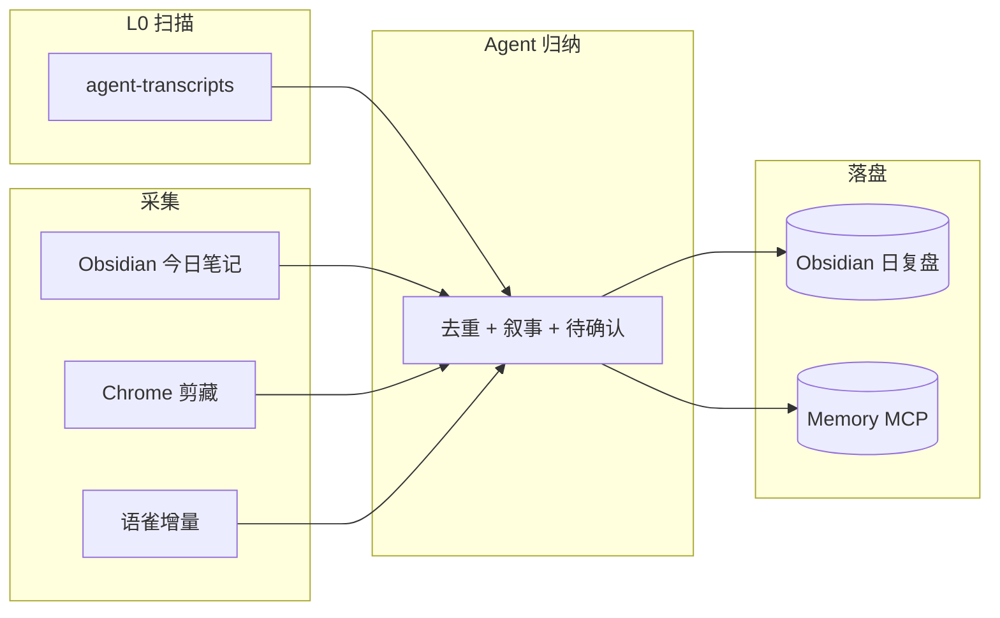

# 四层架构详解


## 设计原则

1. **Context 是 RAM，不是硬盘** — 只放当前任务需要的片段。
2. **巩固在离线** — 睡前或清 context 前，把高价值信息写入可检索载体。
3. **检索按需** — Gety / Memory 拉片段，避免整库进 prompt。
4. **人审闸门** — 机器推断默认不进长期记忆。

## L0：会话扫描（跨 workspace）

Cursor 每个项目有独立 `agent-transcripts/`。若 nightly 只看当前 chat，会漏掉：

- 上午在 A 项目修的 bug
- 下午在 B 项目写的文档
- 晚上在 C 项目的 skill 调试

`scan-day-transcripts.py` 遍历 `~/.cursor/projects/*/agent-transcripts/*.jsonl`，按 `mtime` 过滤「指定日期」，输出：

- 各 workspace 消息条数
- 用户消息预览（脱敏后供 Agent 归纳）

**这是本方案相对「单会话摘要」的核心差异。**

## L1：工作记忆（Context）

| 应放 | 不应放 |
|------|--------|
| 当前文件 diff、错误栈 | 整本 Obsidian |
| 用户刚说的约束 | 上周完整复盘 |
| 1–2 条 recap 链接 | 所有 Skill 全文 |

**Context 预算建议**（个人实践）：

| 内容 | 约 token |
|------|----------|
| 系统 + 规则 + Skills | 视启用数量，可 10k–80k |
| 当前任务代码片段 | 2k–20k |
| recap 链接 + 1 段摘要 | 200–800 |

启用过多 Skill 会挤占推理空间 → 用 **skill-archive-router** 类方案：常用常驻，冷门归档到 Gety。

## L2：热检索（Gety 全盘）

触发：`recall` 模式，或 nightly 前查「这周是否写过类似笔记」。

**不要**把 Gety 索引里所有命中一次性塞进 prompt。

## L2b：专题热检索（精选库）

载体：`CURATED_LIBRARY_ROOT` + Gety connector `Folder: 精选库`

Agent 顺序：读 `{专题}/_index.md` → `gety search -c "Folder: 精选库"` → 不足再 L2 全盘。

详见 [curated-library-workflow.md](curated-library-workflow.md)。

## L3：巩固笔记（Obsidian）

目录约定（可自定义）：

```
{OBSIDIAN_VAULT}/
├── 日复盘/YYYY/YYYY-MM-DD.md
├── 会话巩固/YYYY-MM-DD-<slug>.md
├── 手机录音/YYYY-MM/REC*.md
└── 月回顾·YYYY-MM-DD至....md
```

日复盘是 **人可读叙事** + **机器可检索** 的交汇点。Dataview / MOC 可做二级索引。

## L3b：专题地图（精选库）

目录：`{CURATED_LIBRARY_ROOT}/{专题}/_index.md` — 按**主题**记录权威原件路径、章→考点→题型。与 L3 **按日**复盘互补；Gety 可替换，精选库文件夹仍在。

## L4：实体事实（Memory MCP）

适合写入：

- 项目路径、仓库名
- 用户偏好（「哥哥」、语言、工具链）
- Skill 名称与用途一句话

**禁止写入**：

- API Key、token 明文
- 第三人姓名与私聊内容
- 未确认的 ASR 推断

Memory 是 **索引卡片**，不是日记全文；详情在 Obsidian。

## 数据流（nightly）



## 与 consolidate / recall 的关系

| 模式 | 输入 | 输出 |
|------|------|------|
| nightly | 全天多源 | `日复盘/日期.md` |
| consolidate | 当前长会话 | `会话巩固/日期-slug.md` |
| recall | 用户问题 | 口头回答 + 链接，不一定写文件 |

consolidate 可在任意时刻触发；nightly 建议固定睡前，形成节律。
